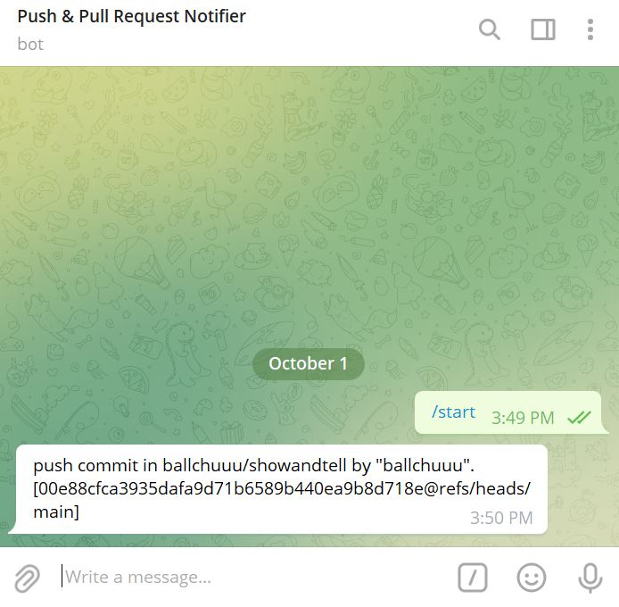

# Show and tell: Telegram Notification for Every Push and Pull Request

#### Aim:
To utilise GitHub actions to provide a workflow that triggers a notification when there is a push or pull request.

#### Process of setting up the workflow:
1. Creating the API token via @BotFather on Telegram
2. Obtaining my own chat ID via the getUpdate Telegram
3. Place the above token and chat ID as secrets in GitHub
4. Adding the yaml file as seen below to GitHub Actions

```
name: Telegram Notifications For Push Request

on: [push, pull_request]

jobs:
  notify:

    runs-on: ubuntu-latest

    steps:
    - name: Send notifications to Telegram
      run: curl -s -X POST https://api.telegram.org/bot${{ secrets.TELEGRAM_TOKEN }}/sendMessage -d chat_id=${{ secrets.TELEGRAM_TO }} -d text="${MESSAGE}" >> /dev/null
      env:
        MESSAGE: |
          ${{ github.event_name }} commit in ${{ github.repository }} by "${{ github.actor }}". [${{github.sha}}@${{ github.ref }}]
```

#### Sample of Telegram message received
<a href="url"></a>


#### Special Thanks!
Referenced from https://odoo-devops.readthedocs.io/en/latest/git/github-telegram-notifications.html :)
